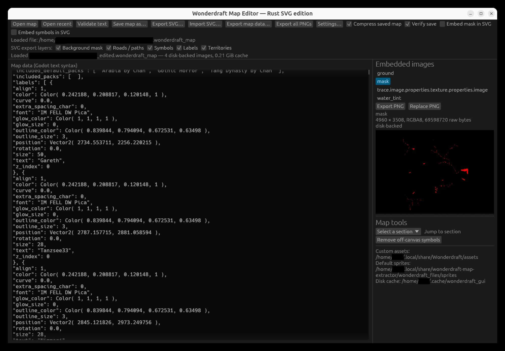
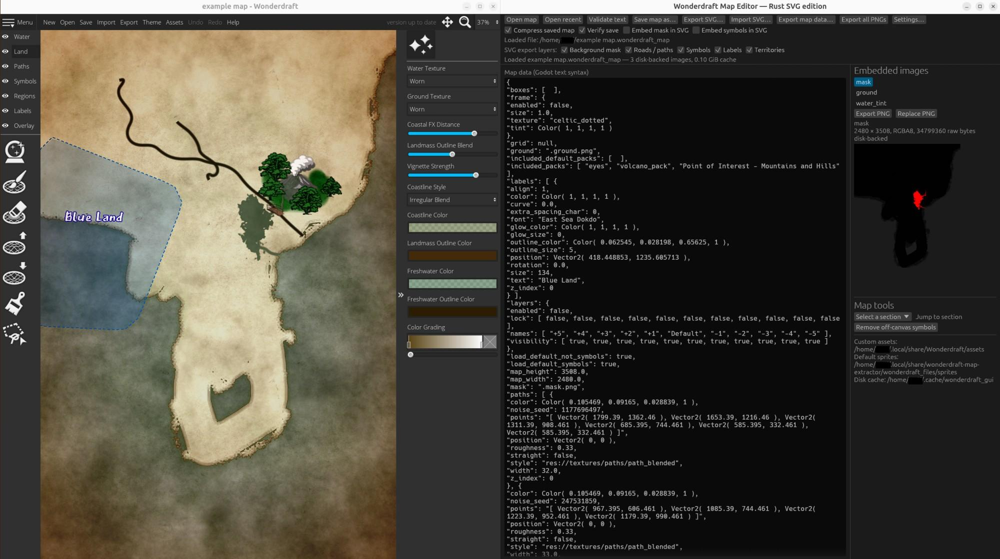
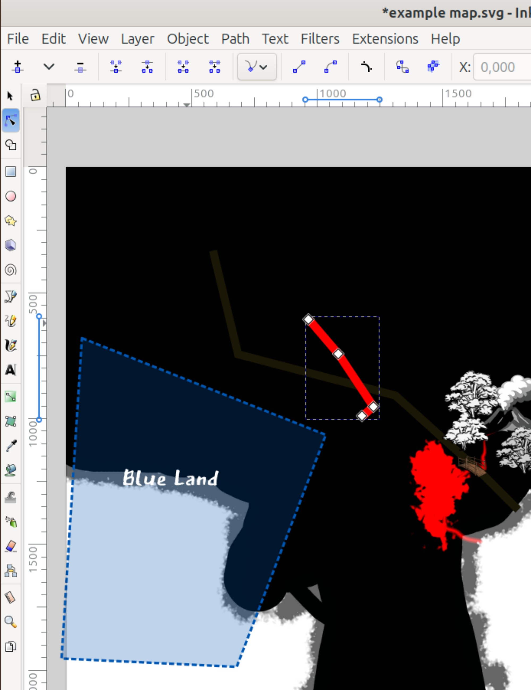
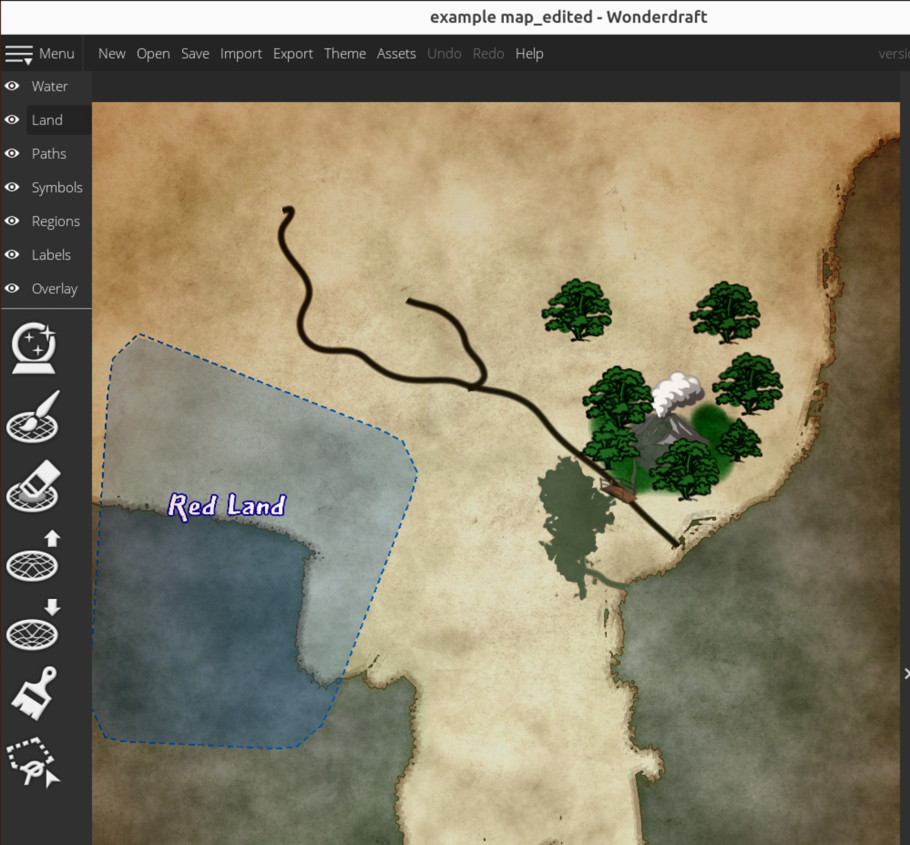

# Miracledraft Map Helper

[](https://github.com/Glumbosch/miracledraft_map_helper/actions/workflows/ci.yml)
[](https://github.com/Glumbosch/miracledraft_map_helper/releases/latest)
[](LICENSE)

A native desktop tool for extracting and manipulating Wonderdraft
`.wonderdraft_map` files. Its main workflow exports map layers to SVG, lets you
edit roads, paths, labels, symbols, and territories in an SVG editor, then
imports those changes into a new Wonderdraft map.

The tool was created in part because Wonderdraft's **Menu → Extract Map Data**
and **Menu → Repackage Map Data** workflow does not work reliably on Linux. It
can also edit the decoded Godot data, extract Wonderdraft's core assets, and
replace embedded map images without loading every binary payload into memory.

> This is an experimental, unofficial tool. Keep an untouched backup of every
> map and test edited maps in Wonderdraft before relying on them.

This project is not affiliated with or endorsed by Wonderdraft or Megasploot.
Wonderdraft itself and its bundled assets are not distributed with this project.

Wonderdraft is required to create and use the maps handled by this tool. Please
[buy Wonderdraft](https://www.wonderdraft.net/) to support its developers.

Full usage documentation is available in the
[project wiki](https://github.com/Glumbosch/miracledraft_map_helper/wiki),
including a [function and keyboard-shortcut reference](https://github.com/Glumbosch/miracledraft_map_helper/wiki/Functions-and-Keyboard-Shortcuts).

## Screenshots

### Main editor

Open a map, inspect or edit its Godot text, choose SVG layers, and work with
embedded images from one window.



### SVG round trip

1. Open the original map in Wonderdraft beside the extracted map data.

   

2. Export the chosen layers and edit their paths, symbols, labels, or
   territories in Inkscape or another SVG editor.

   

3. Import the edited SVG, save a new `.wonderdraft_map`, and verify the result
   in Wonderdraft.

   

## AI generation and public-domain dedication

The current project-authored source code was generated by AI. See the full
[AI generation disclosure](AI_DISCLOSURE.md).

The project is released into the public domain under the
[Unlicense](LICENSE). To the extent that any project contributor holds
copyright or related rights in a contribution, those rights are dedicated to
the public domain. Where such a dedication is not legally possible, the
Unlicense grants permission to use the work without restriction.

This dedication applies only to project-authored material in this repository.
Rust dependencies, Wonderdraft, Wonderdraft assets, user-provided maps and
assets, fonts, trademarks, and other third-party material retain their own
terms and are not relicensed by this project.

## Download

Prebuilt archives for Linux (x86_64), Windows (x86_64), and macOS (Apple
Silicon) are attached to each [GitHub release](https://github.com/Glumbosch/miracledraft_map_helper/releases/latest).
Release archives are produced by GitHub Actions and include SHA-256 checksums.
They also include the default editable `wonderdraft_font_names.txt` mapping used
for faithful SVG label font names.

On Linux, extract the archive and run `./miracledraft-map-helper`. To add it to your
desktop application menu, run `./install-linux-launcher.sh` from the extracted
directory. On Windows, extract the ZIP and run `miracledraft-map-helper.exe`. On
macOS, extract the archive and run `miracledraft-map-helper` from Terminal; because
the binary is currently unsigned, macOS may require explicit approval in
Privacy & Security on first launch.

## Requirements

- Rust 1.87 or newer for building the editor from source.
- A Wonderdraft installation if you want to resolve and export its built-in
  sprites.
- Linux builds use X11 because native drag and drop is required.

## Build and run

Linux and macOS:

```bash
cargo run --release
```

On Linux you can also use the launcher, which selects the X11 backend:

```bash
./start_miracledraft_map_helper.sh
```

Windows:

```bat
start_miracledraft_map_helper.bat
```

The compiled executable is `target/release/miracledraft-map-helper` (or
`miracledraft-map-helper.exe` on Windows).

The Settings window includes an **About** section showing the exact program
version compiled into the running executable. The main window can be resized
down to a narrower layout; toolbar actions and options wrap onto additional
rows instead of forcing a wide minimum window.

### Decode `wd:record` metadata

The dependency-free Python GUI `wd_record_decoder.py` decodes raw `wd:record`
values, complete attribute snippets, or every record in an opened SVG file:

```bash
python3 wd_record_decoder.py
```

It displays the decoded Godot text and can copy or save the result. The tool
uses Python's standard Tkinter GUI; no Python packages need to be installed.
Use **Ctrl+Enter** to decode, **Ctrl+O** to open an SVG, and **Ctrl+S** to save
the decoded text.

### Linux application launcher

After building the release executable, install an application-menu launcher
with:

```bash
./install-linux-launcher.sh
```

The installer copies the executable into the user application-data directory,
uses `miracledraft_map_helper.png` as the fallback launcher icon, installs
`miracledraft_map_helper.svg` as the scalable icon, and creates
`~/.local/share/applications/miracledraft-map-helper.desktop` (or the
equivalent location below `XDG_DATA_HOME`). No administrator access is needed.

The repository also contains `miracledraft-map-helper.desktop`, which is the
portable template used by the installer.

## First-start setup

The setup wizard opens the first time the editor runs. It can be opened again
later with **Settings… → Run setup wizard…**.

1. Confirm the Wonderdraft user-data folder containing `config.ini`. This lets
   the editor find recent maps and custom assets. The usual Linux location is
   `~/.local/share/Wonderdraft`.
2. Extract the core sprites. If `Wonderdraft.pck` is found automatically, click
   **Extract detected Wonderdraft.pck**. Otherwise click
   **Choose Wonderdraft.pck…** and select the file manually.
3. Optionally install fonts for the current user. The wizard has separate
   checkboxes for core fonts from `wonderdraft_files/fonts/` and fonts found in
   custom asset packs. Enable **Choose fonts individually** to select files one
   by one, or use **Skip font installation** to continue without installing
   anything. This does not require administrator access.
4. Confirm the disk-cache folder and finish setup.

The Wonderdraft integration, sprite extraction, and font installation are
optional. You can finish the wizard without them and configure them later.

The font step supports TrueType and OpenType font files (`.ttf`, `.otf`,
`.ttc`, and `.otc`). Custom assets are searched recursively, but a custom font
is included only when it is inside a folder named `fonts` (case-insensitive),
such as `assets/My Pack/fonts/`. Selected fonts install into the platform's
per-user font folder:

- Linux: `$XDG_DATA_HOME/fonts`, or `~/.local/share/fonts`
- macOS: `~/Library/Fonts`
- Windows: `%LOCALAPPDATA%\Microsoft\Windows\Fonts`

Existing identical fonts are counted as already installed. If the destination
contains a different font with the same filename, the installer keeps that
file unchanged and reports the conflict. Linux runs `fc-cache` when available;
Windows registers the fonts for the current user and notifies running
applications; macOS automatically observes its user Fonts folder. Some already
running applications may still need to be restarted before newly installed
fonts appear.

The same wizard step reads the internal family, style, and weight names from
the discovered core and custom font files. It appends new mappings to
`wonderdraft_font_names.txt` in the application working directory. The file is
tab-separated and intentionally editable; rescanning never replaces an
existing label. This lets Wonderdraft's filename-based label—for example
`IM Fell English Italic`—export as the installed family `IM FELL English` with
SVG italic styling.

### Wonderdraft.pck discovery

The editor checks both `Wonderdraft.pck` and the older lowercase
`wonderdraft.pck` spelling. On Linux, filenames are case-sensitive. Standard
search directories include:

- Linux: `/opt/Wonderdraft` and `~/Games/Wonderdraft`
- macOS: `/Applications/Wonderdraft.app/Contents/Resources`
- Windows: the `Wonderdraft` directory below the available Program Files
  locations

For a nonstandard installation, set `WONDERDRAFT_PCK` to the complete pack path
before starting the editor:

```bash
WONDERDRAFT_PCK=/another/location/Wonderdraft.pck \
  ./start_miracledraft_map_helper.sh
```

Extracted files are written to `wonderdraft_files` in the application's working
directory. Wonderdraft image resources are given a `.png` extension, and
`wonderdraft_files/sprites` is saved as the default sprites folder. Extracted
fonts remain in `wonderdraft_files/fonts/` even after they are installed.

## Main workflows

- Open a map with **Open map**, **Open recent**, or drag and drop.
- Validate or edit the complete Godot text representation.
- Press **Ctrl+F** to find text, or use the right-panel section dropdown to jump
  to boxes, symbols, roads/paths, labels, territories, or theme data.
- Export the currently displayed Godot text to a `.txt` file with **Export map
  data…**.
- Remove stale symbols whose complete scaled, offset, rotated, mirrored, and
  outlined bounds are outside the map with **Remove off-canvas symbols**.
- Save a compressed or literal-only map and optionally verify it by decoding it
  again.
- Export or replace embedded `ground`, `mask`, and `water_tint` images.
- Export the background, boxes, roads/paths, symbols, labels, and territories
  to SVG.
- Import edited SVG elements into the open map, then save the result as a new
  `.wonderdraft_map` file.

Built-in `res://sprites/...` textures resolve below the configured core
`sprites` folder. Pack textures such as `res://packs/<pack>/sprites/.../5`
resolve below the sibling `wonderdraft_files/packs` folder and automatically
pick up extracted image extensions such as `.png`.

## SVG round trip

For the most reliable round trip, keep the `wd:*` metadata attributes on SVG
elements. These attributes retain the original Wonderdraft records while the
visible SVG properties are edited. Untagged SVG content is converted on a
best-effort basis because Wonderdraft record formats can differ by version.

The layer checkboxes control whether the background mask, boxes, roads/paths,
symbols, labels, and territories are included. **Embed mask in SVG** stores the
mask as a data URI; otherwise the SVG refers to an external PNG. **Embed boxes
in SVG** stores each embedded box texture as a data URI; otherwise the SVG
links a companion `.box-N.png` file. Box textures are stretched to their map
margin rectangles without reproducing Wonderdraft's nine-patch borders.
**Embed symbols in SVG** writes one base64 PNG definition for each distinct
source symbol and places repeated instances as SVG `<use>` clones, making the
SVG portable without duplicating the same image data.

Symbols with enabled `custom_color_mode` and three `custom_colors` receive a
reusable SVG `<feColorMatrix>` filter. The source image's red, green, and blue
channels select the first, second, and third Wonderdraft custom colors
respectively. Source transparency and each custom color's alpha are retained.

Symbol rotation uses Wonderdraft radians: positive values rotate clockwise and
negative values rotate counter-clockwise in the SVG coordinate system. A
symbol with `mirror: true` is flipped vertically before rotation. Records with
a positive `outline_width` and valid `outline_color` receive a reusable SVG
outline filter.

Roads and territory areas export as SVG `<path>` elements rather than
`<polyline>` or `<polygon>` elements, which makes node editing more convenient
in Inkscape. Their edited path endpoints round-trip to Wonderdraft point lists.

Labels use the mapped installed font family, style, and weight. Text outlines
use `paint-order="markers stroke fill"`, placing the stroke behind the fill.
Label glow uses the record's `glow_color` and uses `glow_size` directly as the
Gaussian blur `stdDeviation`; no glow filter is emitted when `glow_size` is
zero.

Territories retain their encoded records and editable point lists. Territory
fill uses the record's `opacity`, while ordinary and dashed outlines use the
territory color at full opacity. `border_gradient` uses a solid border at twice
the configured width with a 10-pixel Gaussian blur. `border_dash` uses a dashed
outline. `border_dark_dot` uses a black dotted outline with a 0.42 width scale:
Wonderdraft widths 10 and 13 become approximately 4.2 and 5.46 SVG pixels.

## Settings and generated data

`miracledraft_map_helper.config` stores the Wonderdraft, asset, cache, and completed
setup settings as JSON. It also stores the last four maps opened by this editor.
**Open recent** refreshes Wonderdraft's `config.ini` whenever the menu opens and
deduplicates its entries against the editor's own recent list. The editor first
uses a config file in the working
directory when one exists; otherwise it uses a file beside the executable.

Map payloads are unpacked into the configured cache while a map is open. The
cache is cleared on exit by default. Core assets in `wonderdraft_files` are not
cache data and are not removed automatically.

## Troubleshooting

**`Wonderdraft.pck` exists but is not detected**

Check the exact capitalization and location. Current Linux installations often
use `/opt/Wonderdraft/Wonderdraft.pck`. You can select it manually in the wizard
or set `WONDERDRAFT_PCK` to the complete path.

**Symbols are missing from an SVG export**

Open **Settings…** and check both asset paths. Custom assets normally come from
the folder configured in Wonderdraft's `config.ini`; built-in assets come from
the extracted `wonderdraft_files/sprites` folder.

**The file chooser or drag and drop does not work on Linux**

Start the app with `start_miracledraft_map_helper.sh`. The build and launcher
intentionally use X11 for compatible native file dialogs and drag and drop.

## Development and validation

```bash
cargo fmt -- --check
cargo test
cargo clippy --all-targets -- -D warnings
```

Pull requests are welcome. See [CONTRIBUTING.md](CONTRIBUTING.md) for the
development workflow, [SECURITY.md](SECURITY.md) for private vulnerability
reporting, and [LICENSE](LICENSE) for the public-domain dedication.

See [SVG_INTERCHANGE_NOTES.md](SVG_INTERCHANGE_NOTES.md) for format details and
[TEST_REPORT.md](TEST_REPORT.md) for the map/SVG verification scope.

## Making a release

Update the version in `Cargo.toml`, commit the corresponding `Cargo.lock`
change, and push a matching semantic-version tag such as `v0.4.4`. The release
workflow validates the version, builds all supported packages, generates
checksums and provenance attestations, and publishes a GitHub release with
automatically generated notes. See [RELEASING.md](RELEASING.md) for the exact
maintainer checklist.
